# 00. Contexto completo del sistema

Este diagrama ubica las dos superficies principales y sus fronteras. `app-gateway` decide estado, datos, errores, vistas y assets. `app-surface` mejora progresivamente el HTML emitido por el gateway.

```mermaid
%%{init: {"theme": "Redux Dark", "themeVariables": {"background": "#0B1020", "primaryColor": "#172033", "primaryTextColor": "#F8FAFC", "primaryBorderColor": "#38BDF8", "lineColor": "#94A3B8", "clusterBkg": "#111827", "clusterBorder": "#475569", "fontFamily": "Inter, Segoe UI, Arial"}}}%%
flowchart LR
  Browser["Browser<br/>usuario final"] --> GatewayEntry["app-gateway/public/index.php<br/>entrada HTTP"]

  subgraph Gateway["app-gateway: backend PHP"]
    GatewayEntry --> CoreRuntime["Core<br/>bootstrap, HTTP, routing, responses"]
    CoreRuntime --> Extension["Extension<br/>features concretas"]
    Extension --> Views["resources/views<br/>layouts, pages, fragments"]
    Extension --> UseCases["Application/UseCase<br/>intención de aplicación"]
    UseCases --> Services["Application/Service<br/>composición cuando aporta valor"]
    Services --> Connectors["Infrastructure/Outbound/Connector<br/>connectors"]
    Connectors --> External["Servicios externos<br/>pagos<br/>ventas<br/>u otros"]
    Views --> HtmlJson["HTML / JSON / redirect"]
  end

  subgraph Surface["app-surface: frontend progresivo"]
    Entry["main.ts"] --> Startup["platform/startup<br/>layouts y errores globales"]
    Startup --> Runtime["platform/runtime<br/>pages, fragments, bindings"]
    Runtime --> Workspace["workspace/integrations<br/>UI concreta"]
    Workspace --> Toolkit["toolkit<br/>adapters y helpers opt-in"]
  end

  HtmlJson --> Browser
  Browser --> Entry
  Workspace -->|"serverClient.html/json/data"| GatewayEntry
  CoreRuntime -->|"vite_styles / vite_script"| Assets["ui-assets manifest<br/>Vite build"]
  Assets --> Browser

  classDef client fill:#1E1B4B,stroke:#A78BFA,stroke-width:2px,color:#F5F3FF;
  classDef gateway fill:#082F49,stroke:#38BDF8,stroke-width:2px,color:#E0F2FE;
  classDef app fill:#132E24,stroke:#4ADE80,stroke-width:2px,color:#DCFCE7;
  classDef outbound fill:#3B2F13,stroke:#F59E0B,stroke-width:2px,color:#FEF3C7;
  classDef surface fill:#2A223A,stroke:#C084FC,stroke-width:2px,color:#F3E8FF;
  classDef asset fill:#3F1D2B,stroke:#FB7185,stroke-width:2px,color:#FFE4E6;

  class Browser client;
  class GatewayEntry,CoreRuntime,Views,HtmlJson gateway;
  class Extension,UseCases,Services app;
  class Connectors,External outbound;
  class Entry,Startup,Runtime,Workspace,Toolkit surface;
  class Assets asset;
```

## Lectura recomendada

El gateway entrega el documento y decide qué pasó. Surface entra después para activar comportamiento UI sobre lo que ya vino del servidor; es decir, la frontera clave está en los contratos: HTML SSR, envelope JSON, headers de sesión, manifest de assets y firmas TypeScript locales en `workspace/integrations/<feature>/contracts.ts` para payloads o `data` visibles desde Gateway. Surface puede coordinar UI, pero no debe duplicar dominio ni reglas de aplicación.
