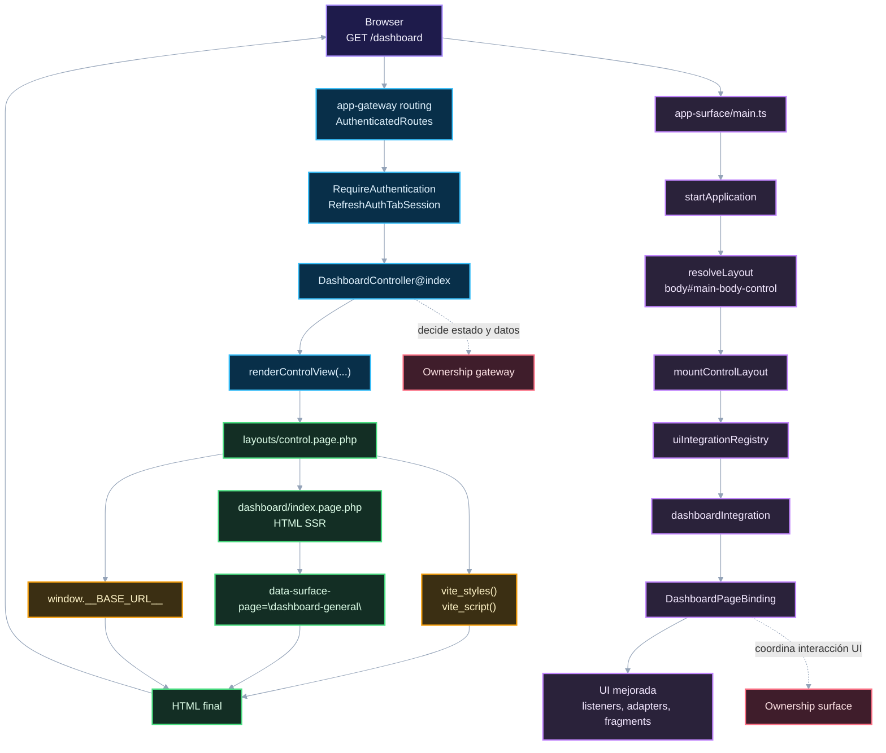

# 01. SSR y Progressive Enhancement

Este diagrama muestra el camino completo de una página SSR con comportamiento UI.

## Lectura recomendada

El servidor entrega la página ya armada. Surface encuentra `data-surface-page` y conecta comportamiento encima; eso quiere decir que, el contrato de montaje es declarativo. El backend no importa módulos frontend y el frontend no decide qué página debe existir.

## Navegación

Siguiente: [02. Fragments y contenido dinámico](02-fragments-dynamic-content.md)

Volver al [índice bridge](README.md).
