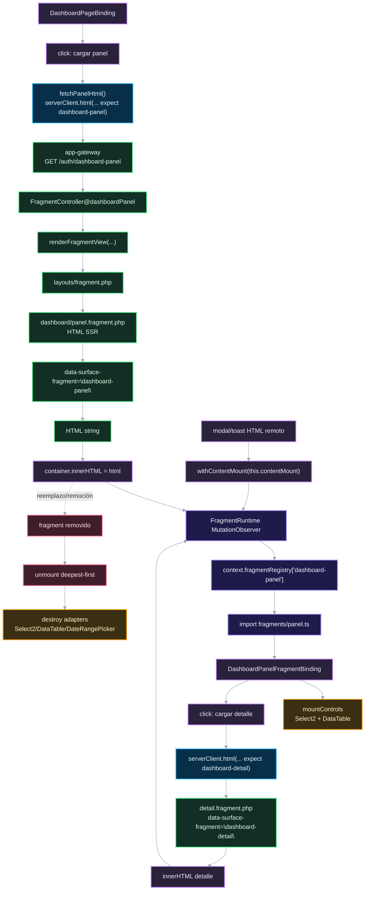

# 02. Fragments y contenido dinámico

Este diagrama muestra cómo se inserta HTML remoto y cómo `FragmentRuntime` lo activa sin montaje manual desde la feature.

## Puntos de control

- La integración inserta HTML; el runtime monta fragments por observer.
- La carga progresiva valida HTML embebible y el `data-surface-fragment` esperado antes de insertar.
- El fragment debe estar registrado dentro de la integración propietaria.
- Los adapters se destruyen cuando el fragment sale del DOM.
- Modal y toast necesitan `contentMount` si su HTML remoto trae fragments.

## Navegación

Anterior: [01. SSR y Progressive Enhancement](01-ssr-progressive-enhancement.md)

Siguiente: [03. JSON, sesión y assets compartidos](03-json-session-assets-contracts.md)

Volver al [índice bridge](README.md).
