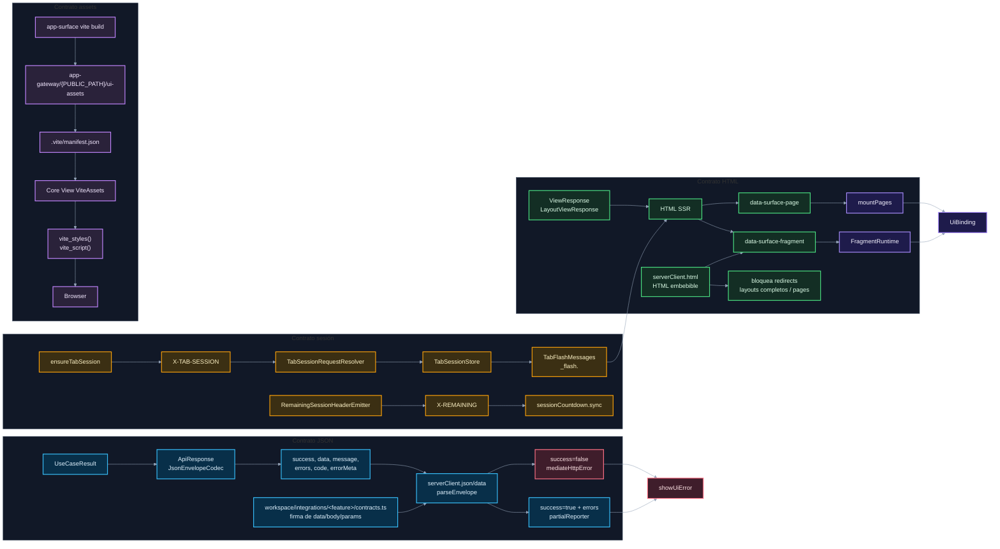

# 03. JSON, sesión y assets compartidos

Este diagrama resume los contratos que cruzan `app-gateway` y `app-surface`.

## Tabla rápida de ownership

| Contrato                | Dueño principal                                                     | Consumidor                                      |
| ----------------------- | ------------------------------------------------------------------- | ----------------------------------------------- |
| Envelope JSON           | `app-gateway/Core\Http\Response` y `Extension\Response\ApiResponse` | `app-surface/platform/infrastructure/http`      |
| Firma TS de `data/body` | ruta Gateway visible para Surface                                   | `workspace/integrations/<feature>/contracts.ts` |
| HTML SSR                | `app-gateway/resources/views`                                       | `app-surface/platform/runtime`                  |
| HTML progresivo         | `serverClient.html(...)`                                            | valida HTML embebible antes de insertar         |
| `data-surface-page`     | vista SSR + integración UI acordada                                 | `mountPages(...)`                               |
| `data-surface-fragment` | fragment SSR + integración propietaria                              | `FragmentRuntime`                               |
| `X-TAB-SESSION`         | `app-surface` lo envía, gateway lo valida                           | sesión backend por pestaña                      |
| `_flash.<tabId>`        | `app-gateway` lo escribe y consume                                  | HTML SSR del siguiente request                  |
| `X-REMAINING`           | gateway lo emite                                                    | contador frontend                               |
| Manifest Vite           | `app-surface` lo genera                                             | `Core\View\ViteAssets` lo resuelve              |

## Navegación

Anterior: [02. Fragments y contenido dinámico](02-fragments-dynamic-content.md)

Volver al [índice bridge](README.md).
