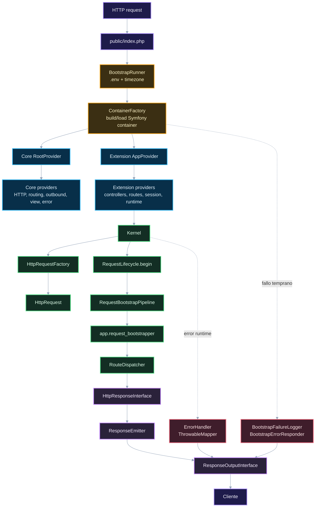

# 01. Runtime, bootstrap y ciclo HTTP

Este diagrama sigue la entrada de un request hasta que el kernel entrega una response.

## Puntos de control

- `Core` registra mecanismos transversales.
- `Extension` registra aplicación concreta.
- Los fallos de bootstrap y los errores runtime tienen carriles separados.
- El kernel no debería saber de features concretas más allá de lo que le entrega el contenedor.

## Navegación

Siguiente: [02. Routing, middleware y controller](02-routing-middleware-controller.md)

Volver al [índice de gateway](README.md).
