# 02. Routing, middleware y controller

Este diagrama muestra cómo un request llega a un controller de `Extension`.

```mermaid
%%{init: {"theme": "Redux Dark", "themeVariables": {"background": "#0B1020", "primaryColor": "#172033", "primaryTextColor": "#F8FAFC", "primaryBorderColor": "#38BDF8", "lineColor": "#94A3B8", "clusterBkg": "#111827", "clusterBorder": "#475569", "fontFamily": "Inter, Segoe UI, Arial"}}}%%
flowchart LR
  Request["HttpRequest"] --> RouteDispatcher["RouteDispatcher"]

  subgraph Routing["Routing"]
    RouteDispatcher --> RouteCache["RouteCache"]
    RouteCache --> Router["Router"]
    Router --> RouteMatch["RouteMatch"]
    Routes["ExtensionRouteRegister<br/>PublicRoutes / AuthenticatedRoutes"] --> Router
  end

  subgraph Middleware["Middleware pipeline"]
    RouteMatch --> MiddlewarePipeline["MiddlewarePipeline"]
    MiddlewarePipeline --> RequireAuth["RequireAuthentication"]
    RequireAuth --> RefreshTab["RefreshAuthTabSession<br/>cuando aplica"]
    RefreshTab --> Chain["MiddlewareChain.proceed"]
  end

  subgraph ControllerLayer["Controller execution"]
    Chain --> ControllerActionHandler["ControllerActionHandler"]
    ControllerActionHandler --> ControllerInvoker["ControllerInvoker"]
    ControllerInvoker --> AppController["AppController concreto"]
    AppController --> ControllerApi["API visible<br/>respondJson / render* / abortController<br/>flashMessage / pullFlashMessages"]
  end

  ControllerApi --> Response["HttpResponseInterface"]

  AppController -. "fallo controlado de presentación/request" .-> ControllerAbort["ControllerFailure<br/>ControllerAbort<br/>TabSessionRequired"]
  ControllerAbort --> Response

  classDef route fill:#082F49,stroke:#38BDF8,stroke-width:2px,color:#E0F2FE;
  classDef mid fill:#3B2F13,stroke:#F59E0B,stroke-width:2px,color:#FEF3C7;
  classDef ctrl fill:#132E24,stroke:#4ADE80,stroke-width:2px,color:#DCFCE7;
  classDef response fill:#2A223A,stroke:#C084FC,stroke-width:2px,color:#F3E8FF;
  classDef error fill:#3F1D2B,stroke:#FB7185,stroke-width:2px,color:#FFE4E6;

  class Request,RouteDispatcher,RouteCache,Router,RouteMatch,Routes route;
  class MiddlewarePipeline,RequireAuth,RefreshTab,Chain mid;
  class ControllerActionHandler,ControllerInvoker,AppController,ControllerApi ctrl;
  class Response response;
  class ControllerAbort error;
```

## Puntos de control

- Las rutas viven en archivos de routing, no escondidas en controllers.
- Middleware corta o deja pasar request, pero no ejecuta casos de uso.
- Controller adapta input HTTP y decide tipo de salida.
- Los mensajes flash se escriben/consumen desde `AppController`; no pertenecen al use case.
- Los fallos controlados de controller viven en `Presentation/Http/Failure` y pertenecen a presentación o request imposible antes del use case.

## Navegación

Anterior: [01. Runtime, bootstrap y ciclo HTTP](01-runtime-bootstrap-http.md)

Siguiente: [03. Use cases, resultados y errores](03-usecases-results-errors.md)

Volver al [índice de gateway](README.md).
