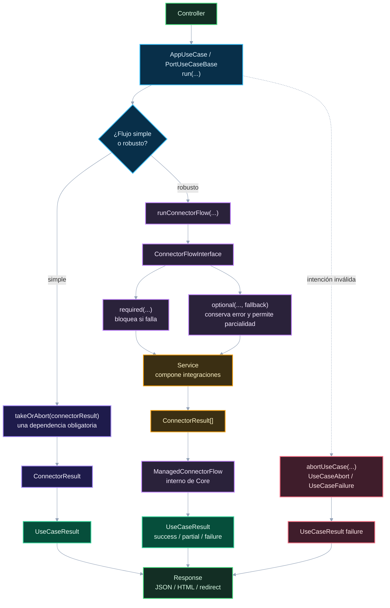

# 03. Use cases, resultados y errores

Este diagrama muestra los dos carriles de use case y cómo se normalizan resultados y fallos controlados.

## Puntos de control

- `takeOrAbort(...)` es para un connector obligatorio directo.
- `runConnectorFlow(...)` es para composición, opcionales, fallback o parcialidad.
- `Extension` no debe importar `ManagedConnectorFlow` ni factories internas de resultados.
- Los fallos controlados de use case viven en `Application/Failure`; `UseCaseAbort` es el corte manual de `abortUseCase(...)`.
- La parcialidad no se infiere por cantidad de errores, sino por significado del flujo.

## Navegación

Anterior: [02. Routing, middleware y controller](02-routing-middleware-controller.md)

Siguiente: [04. Outbound, services y connectors](04-outbound-services-connectors.md)

Volver al [índice de gateway](README.md).
