# 04. Outbound, services y connectors

Este diagrama separa aplicación, integración y transporte externo.

```mermaid
%%{init: {"theme": "Redux Dark", "themeVariables": {"background": "#0B1020", "primaryColor": "#172033", "primaryTextColor": "#F8FAFC", "primaryBorderColor": "#38BDF8", "lineColor": "#94A3B8", "clusterBkg": "#111827", "clusterBorder": "#475569", "fontFamily": "Inter, Segoe UI, Arial"}}}%%
flowchart LR
  UseCase["UseCase"] -->|"simple"| Port["Application/Port<br/>ConnectorInterface"]
  UseCase -->|"robusto"| Service["Application/Service<br/>coordina varias llamadas"]
  Service --> Port

  subgraph ExtensionInfra["Extension Infrastructure"]
    Port --> Connector["Infrastructure/Outbound/Connector<br/>&lt;Name&gt;Connector"]
    Connector --> ServiceClient["Infrastructure/Outbound/Client/&lt;Service&gt;<br/>ServiceClient"]
    Connector --> RequestDto["Infrastructure/Outbound/Client/&lt;Service&gt;/Request<br/>EndpointRequest / EndpointListRequest"]
    Connector --> ResponseDto["Contract/Outbound<br/>DTOs externos"]
  end

  subgraph CoreOutbound["Core Outbound"]
    ServiceClient --> EndpointFactory["EndpointOutboundRequestFactory"]
    RequestDto --> EndpointFactory
    EndpointFactory --> JsonServiceClient["JsonServiceClient"]
    JsonServiceClient --> HttpClient["HttpClientInterface"]
    JsonServiceClient --> Mapper["JsonServiceResponseMapper<br/>ResponseHydrator"]
  end

  HttpClient --> External["Servicio externo"]
  External --> ExternalResult["ExternalServiceResult"]
  ExternalResult --> ConnectorResult["ConnectorResult"]
  ConnectorResult --> Port
  ConnectorResult --> UseCase

  Config["services.json<br/>API_<SERVICIO>_* env"] --> JsonServiceClient

  Connector -. "no debe" .-> Forbidden["UseCaseResult<br/>HTML / JSON / UI"]

  classDef app fill:#132E24,stroke:#4ADE80,stroke-width:2px,color:#DCFCE7;
  classDef infra fill:#3B2F13,stroke:#F59E0B,stroke-width:2px,color:#FEF3C7;
  classDef core fill:#082F49,stroke:#38BDF8,stroke-width:2px,color:#E0F2FE;
  classDef external fill:#1E1B4B,stroke:#A78BFA,stroke-width:2px,color:#F5F3FF;
  classDef result fill:#064E3B,stroke:#34D399,stroke-width:2px,color:#ECFDF5;
  classDef error fill:#3F1D2B,stroke:#FB7185,stroke-width:2px,color:#FFE4E6;

  class UseCase,Service,Port app;
  class Connector,ServiceClient,RequestDto,ResponseDto infra;
  class EndpointFactory,JsonServiceClient,HttpClient,Mapper,Config core;
  class External external;
  class ExternalResult,ConnectorResult result;
  class Forbidden error;
```

## Puntos de control

- El service existe solo si compone o transforma con significado.
- El connector traduce sistemas externos a `ConnectorResult`.
- `ExternalServiceResult` pertenece al transporte externo.
- `ConnectorResult` pertenece al mundo de integración.
- El connector no debe conocer UI ni construir `UseCaseResult`.

## Navegación

Anterior: [03. Use cases, resultados y errores](03-usecases-results-errors.md)

Siguiente: [05. Views, JSON y assets](05-views-json-assets.md)

Volver al [índice de gateway](README.md).
