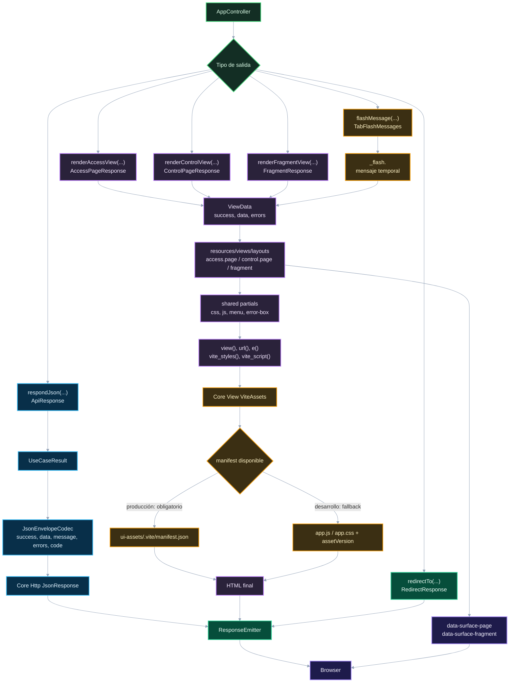

# 05. Views, JSON y assets

Este diagrama muestra cómo `app-gateway` adapta resultados a salidas HTML, JSON, redirect y assets Vite.

## Puntos de control

- HTML lo renderiza `app-gateway`; `app-surface` solo lo activa.
- JSON debe respetar el envelope de `UseCaseResult`.
- Los mensajes flash son estado temporal por pestaña: se escriben antes de redirect y se consumen al renderizar la siguiente vista.
- `data-surface-*` es contrato declarativo para surface.
- La resolución de assets Vite pertenece a `Core\View\ViteAssets`, no a integraciones UI.

## Navegación

Anterior: [04. Outbound, services y connectors](04-outbound-services-connectors.md)

Siguiente: [06. DI, observabilidad y headers](06-di-observability-headers.md)

Volver al [índice de gateway](README.md).
