# 06. DI, observabilidad y headers

Este diagrama muestra piezas transversales del gateway que suelen afectar más de una feature.

```mermaid
%%{init: {"theme": "Redux Dark", "themeVariables": {"background": "#0B1020", "primaryColor": "#172033", "primaryTextColor": "#F8FAFC", "primaryBorderColor": "#38BDF8", "lineColor": "#94A3B8", "clusterBkg": "#111827", "clusterBorder": "#475569", "fontFamily": "Inter, Segoe UI, Arial"}}}%%
flowchart LR
  subgraph DI["Dependency Injection"]
    ContainerFactory["ContainerFactory"] --> CoreRoot["Core RootProvider"]
    ContainerFactory --> ExtensionApp["Extension AppProvider"]
    CoreRoot --> CoreProviders["Core providers<br/>application, routing, filesystem,<br/>outbound, observability, errors,<br/>controllers, middleware"]
    ExtensionApp --> ExtensionProviders["Extension providers<br/>application, controllers, middleware,<br/>routing, responses, runtime, session,<br/>connectors, outbound"]
    CoreProviders --> CoreTags["Core tags<br/>routes, middleware, bootstrappers, headers"]
    ExtensionProviders --> AppTags["Extension tags<br/>routes, headers, session"]
  end

  subgraph Lifecycle["Request lifecycle"]
    Kernel["Kernel"] --> LifecycleBegin["RequestLifecycle.begin"]
    LifecycleBegin --> TelemetryContext["RequestTelemetryContext"]
    Kernel --> RouteDispatcher["RouteDispatcher"]
    RouteDispatcher --> Response["HttpResponseInterface"]
    Response --> LifecycleMark["RequestLifecycle.markResponse"]
    LifecycleMark --> LifecycleComplete["RequestLifecycle.complete"]
  end

  subgraph Headers["Headers"]
    ResponseEmitter["ResponseEmitter"] --> HeaderEmitters["app.header_emitter"]
    HeaderEmitters --> Correlation["CorrelationIdHeaderEmitter"]
    HeaderEmitters --> Remaining["RemainingSessionHeaderEmitter<br/>X-REMAINING"]
    ResponseEmitter --> Output["ResponseOutputInterface"]
  end

  subgraph Errors["Errores"]
    ErrorHandler["ErrorHandler"] --> ThrowableMapper["ThrowableMapper"]
    ThrowableMapper --> ErrorReporter["RequestErrorReporter"]
    ErrorReporter --> ErrorPresenter["ErrorPresenter"]
  end

  subgraph Observability["Observabilidad"]
    ObservabilityConfig["ObservabilityConfig<br/>LOG_UPSTREAM_SPANS"]
    RequestTelemetryLogger["RequestTelemetryLogger<br/>access / metrics / error / upstream"]
    TracingHttpClient["TracingHttpClient<br/>spans upstream"]
    LogWriterFactory["LogWriterFactory"]
    StreamWriter["StreamLogWriter<br/>CLI php://stdout"]
    WeeklyWriter["WeeklyJsonLineLogWriter<br/>var/log/{env}/{semana}/stdout.jsonl"]
  end

  CoreTags --> Kernel
  AppTags --> Kernel
  LifecycleComplete --> RequestTelemetryLogger
  ErrorReporter --> RequestTelemetryLogger
  TracingHttpClient --> TelemetryContext
  TracingHttpClient --> RequestTelemetryLogger
  ObservabilityConfig --> RequestTelemetryLogger
  RequestTelemetryLogger --> LogWriterFactory
  LogWriterFactory -->|"PHP_SAPI=cli"| StreamWriter
  LogWriterFactory -->|"web"| WeeklyWriter
  Response --> ResponseEmitter
  ErrorPresenter --> Output

  classDef di fill:#082F49,stroke:#38BDF8,stroke-width:2px,color:#E0F2FE;
  classDef life fill:#132E24,stroke:#4ADE80,stroke-width:2px,color:#DCFCE7;
  classDef header fill:#2A223A,stroke:#C084FC,stroke-width:2px,color:#F3E8FF;
  classDef obs fill:#3B2F13,stroke:#F59E0B,stroke-width:2px,color:#FEF3C7;
  classDef error fill:#3F1D2B,stroke:#FB7185,stroke-width:2px,color:#FFE4E6;

  class ContainerFactory,CoreRoot,ExtensionApp,CoreProviders,ExtensionProviders,CoreTags,AppTags di;
  class Kernel,LifecycleBegin,RouteDispatcher,Response,LifecycleMark,LifecycleComplete life;
  class ResponseEmitter,HeaderEmitters,Correlation,Remaining,Output header;
  class TelemetryContext,ObservabilityConfig,RequestTelemetryLogger,TracingHttpClient,LogWriterFactory,StreamWriter,WeeklyWriter obs;
  class ErrorHandler,ThrowableMapper,ErrorReporter,ErrorPresenter error;
```

## Puntos de control

- Si cambias providers, valida tags y aliases relacionados. `Core` registra infraestructura genérica; `Extension` registra controllers, middlewares, rutas, runtime y outbound concretos de la app.
- `X-REMAINING` conecta backend session con frontend session countdown.
- Observabilidad cruza lifecycle, outbound, headers y errores.
- En web, Core escribe JSONL semanal bajo `var/log/develop` o `var/log/production`; en CLI escribe por `stdout` y puede persistirse con `tools/Observability/log-collector/collect.php`. El visor permitido bajo `tools/` es `tools/Observability/log-viewer`.
- `LOG_UPSTREAM_SPANS` controla si se emite detalle por cada llamada upstream.
- No registres piezas transversales desde una feature si pertenecen a `Core`.

## Navegación

Anterior: [05. Views, JSON y assets](05-views-json-assets.md)

Volver al [índice de gateway](README.md).
