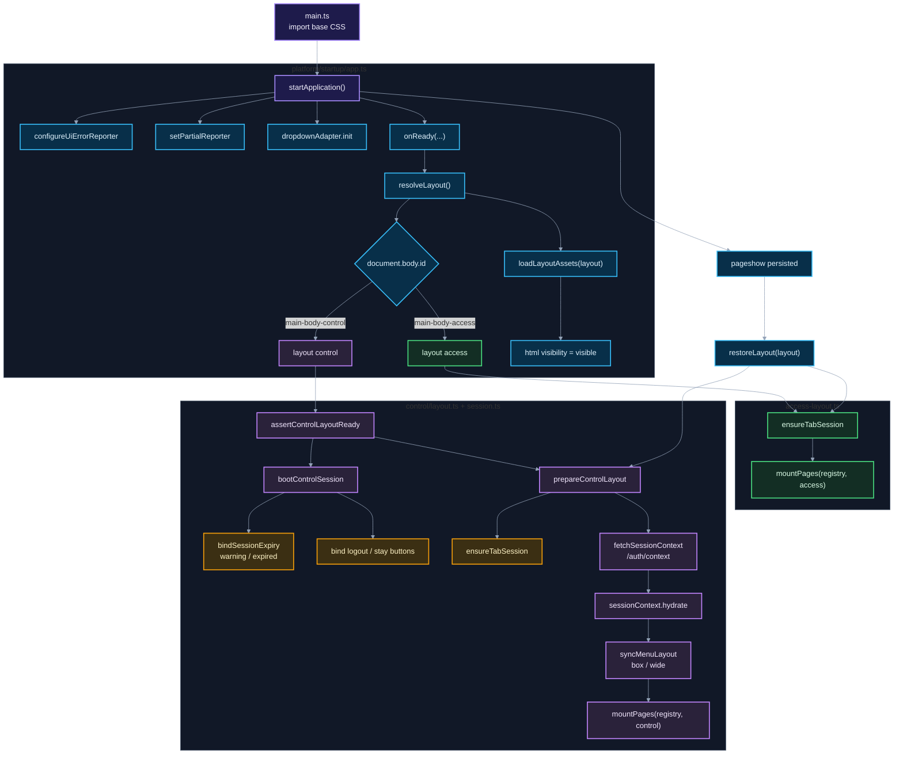

# 01. Startup y layouts

Este diagrama muestra cómo `main.ts` arranca `app-surface` y especializa el montaje por layout.

## Puntos de control

- El layout depende de `body.id`, emitido por `app-gateway`.
- `access` solo asegura tab session y monta pages de acceso.
- `control` separa la UX de sesión en `bootControlSession()` y la hidratación/menú en `prepareControlLayout()`.
- La infraestructura de sesión solo emite eventos; el layout `control` decide modal, logout y redirect.
- BFCache restaura lo mínimo sensible, especialmente la sesión de pestaña.

## Navegación

Siguiente: [02. Runtime, pages, fragments y bindings](02-runtime-pages-fragments-bindings.md)

Volver al [índice de surface](README.md).
