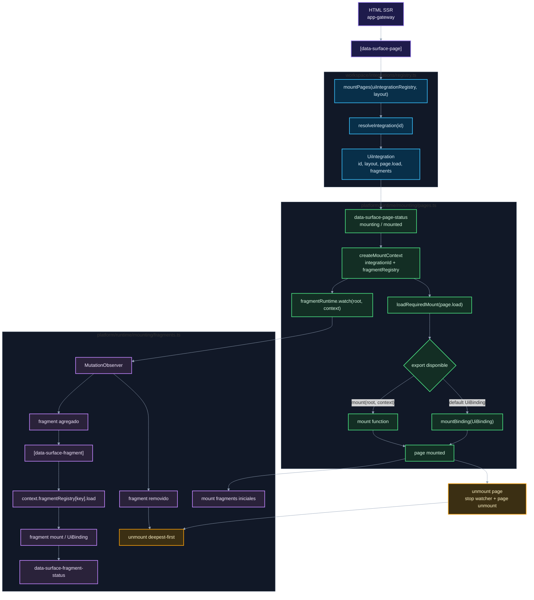

# 02. Runtime, pages, fragments y bindings

Este diagrama muestra cómo el runtime encuentra roots declarados por SSR y carga módulos frontend bajo demanda.

## Puntos de control

- `data-surface-page` debe existir en el registry.
- Los fragments se registran dentro de la integración propietaria.
- El runtime acepta `mount(...)` o una clase `UiBinding` por default.
- El desmontaje deepest-first protege adapters y DOM anidado.

## Navegación

Anterior: [01. Startup y layouts](01-startup-layouts.md)

Siguiente: [03. HTTP, sesión y errores UI](03-http-session-errors.md)

Volver al [índice de surface](README.md).
