# 03. HTTP, sesión y errores UI

Este diagrama une `serverClient`, el contrato JSON/HTML, los headers de sesión y el feedback de errores.

```mermaid
%%{init: {"theme": "Redux Dark", "themeVariables": {"background": "#0B1020", "primaryColor": "#172033", "primaryTextColor": "#F8FAFC", "primaryBorderColor": "#38BDF8", "lineColor": "#94A3B8", "clusterBkg": "#111827", "clusterBorder": "#475569", "fontFamily": "Inter, Segoe UI, Arial"}}}%%
flowchart LR
  UiAction["UiBinding action<br/>onClick + guardUiAction"] --> ServerClient["serverClient"]

  subgraph ClientApi["platform/infrastructure/http"]
    ServerClient --> Json["json(...)<br/>ApiResponse envelope"]
    ServerClient --> Data["data(...)<br/>exige data usable"]
    ServerClient --> Html["html(...)<br/>exige HTML embebible"]
    Json --> RequestResource["requestResource"]
    Data --> RequestResource
    Html --> RequestResource
    Html --> HtmlExpectation["expect opcional<br/>fragmentId esperado"]
    RequestResource --> BuildUrl["baseUrl(route)<br/>window.__BASE_URL__"]
    BuildUrl --> Hooks["readHttpSessionHooks"]
    Hooks --> TabHeader["X-TAB-SESSION"]
  end

  TabHeader --> Gateway["app-gateway endpoint"]
  Gateway --> Response["Response"]
  Response --> Remaining["X-REMAINING"]
  Remaining --> Countdown["sessionCountdown.sync"]
  Countdown --> Warning["warning event<br/>SESSION_EXPIRY_ALERT"]
  Countdown --> Expired["expired event"]
  Warning --> ControlSession["startup/control/session.ts<br/>modal /auth/show-remaining-session"]
  Expired --> ControlLogout["startup/control/session.ts<br/>logout + redirect"]
  Response --> Parser{"Contrato esperado"}

  Parser -->|"JSON envelope"| ParseEnvelope["parseEnvelope<br/>normalizeEnvelope"]
  Parser -->|"HTML"| EnsureHtml["ensureHtmlResponse<br/>bloquea redirects/layouts/pages"]
  Parser -->|"contrato inválido"| ContractError["HttpContractError<br/>FatalError"]

  ParseEnvelope --> Partial{"success=true<br/>errors.length > 0"}
  Partial -->|"sí"| PartialReporter["partialReporter<br/>SweetAlert toast"]
  Partial -->|"no"| Result["Resultado usable"]
  HtmlExpectation --> EnsureHtml
  EnsureHtml --> Result

  ParseEnvelope -->|"success=false / !ok"| Mediate["mediateHttpError"]
  Mediate --> UserAction["UserActionError"]
  Mediate --> SessionError["SessionError"]
  Mediate --> Fatal["FatalError"]
  ContractError --> ShowError["showUiError"]
  UserAction --> ShowError
  SessionError --> ShowError
  Fatal --> ShowError

  classDef ui fill:#1E1B4B,stroke:#A78BFA,stroke-width:2px,color:#F5F3FF;
  classDef http fill:#082F49,stroke:#38BDF8,stroke-width:2px,color:#E0F2FE;
  classDef session fill:#3B2F13,stroke:#F59E0B,stroke-width:2px,color:#FEF3C7;
  classDef gateway fill:#132E24,stroke:#4ADE80,stroke-width:2px,color:#DCFCE7;
  classDef result fill:#064E3B,stroke:#34D399,stroke-width:2px,color:#ECFDF5;
  classDef error fill:#3F1D2B,stroke:#FB7185,stroke-width:2px,color:#FFE4E6;

  class UiAction,ServerClient ui;
  class Json,Data,Html,HtmlExpectation,RequestResource,BuildUrl,Hooks,Parser,ParseEnvelope,EnsureHtml,Mediate http;
  class TabHeader,Remaining,Countdown,Warning,Expired session;
  class Gateway,Response gateway;
  class Partial,PartialReporter,Result result;
  class ContractError,UserAction,SessionError,Fatal,ShowError,ControlSession,ControlLogout error;
```

## Puntos de control

- Usa `serverClient` para endpoints del gateway.
- Las firmas de `params`, `body` y `data` no pertenecen a `platform/infrastructure/http`; viven en `workspace/integrations/<feature>/contracts.ts`.
- `serverClient.html(...)` no acepta JSON por accidente, layouts completos, pages de Surface ni redirects.
- Si espera un fragment montable, debe declarar `expect: { kind: "fragment", fragmentId: "..." }`.
- `success=true` con errores es parcialidad, no éxito silencioso.
- `X-TAB-SESSION` y `X-REMAINING` son el puente de sesión frontend/backend.
- `sessionCountdown` solo sincroniza estado y eventos; `startup/control/session.ts` decide modal, logout y redirect.
- Surface muestra errores UI, pero no redefine el contrato de aplicación.

## Navegación

Anterior: [02. Runtime, pages, fragments y bindings](02-runtime-pages-fragments-bindings.md)

Siguiente: [04. Workspace, toolkit y adapters](04-workspace-toolkit-adapters.md)

Volver al [índice de surface](README.md).
