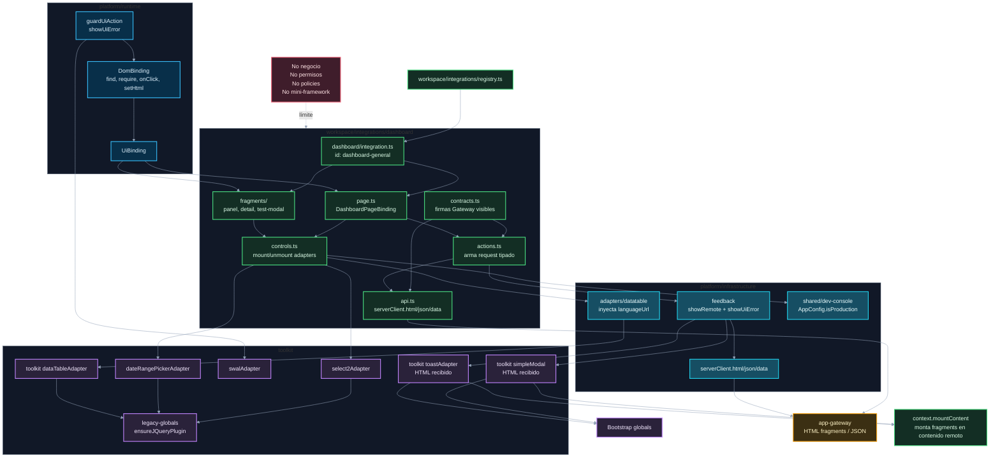

# 04. Workspace, toolkit y adapters

Este diagrama muestra dónde viven las integraciones UI concretas y cómo usan adapters técnicos sin convertir surface en dominio.

## Puntos de control

- `workspace` expresa UI concreta, no dominio.
- `contracts.ts` declara firmas TS del contrato Gateway visible para la integración; si el shape coincide con un DTO externo por passthrough, Surface igual no consume el proveedor directo.
- `actions.ts` recibe valores de `page.ts` o fragments, arma requests tipados y coordina `api.ts` con feedback.
- `platform/infrastructure` adapta config, HTTP y error UI antes de llamar a `toolkit`.
- `toolkit` envuelve librerías y helpers técnicos sin importar `platform`.
- Helpers nuevos viven según su responsabilidad: DOM en `toolkit/dom`, utilidades puras en `toolkit/shared`, plugins visuales en `toolkit/adapters` y feedback técnico en `toolkit/feedback`.
- Los adapters son opt-in y se importan donde se usan.
- Los adapters que dependen de plugins jQuery validan globals con `legacy-globals` y luego usan `$()` directamente.
- Si un adapter crea estado externo, debe destruirse en `unmount`.
- `withContentMount(this.contentMount)` activa fragments dentro de modales y toasts.

## Navegación

Anterior: [03. HTTP, sesión y errores UI](03-http-session-errors.md)

Siguiente: [05. Vite, styles y assets](05-vite-styles-assets.md)

Volver al [índice de surface](README.md).
