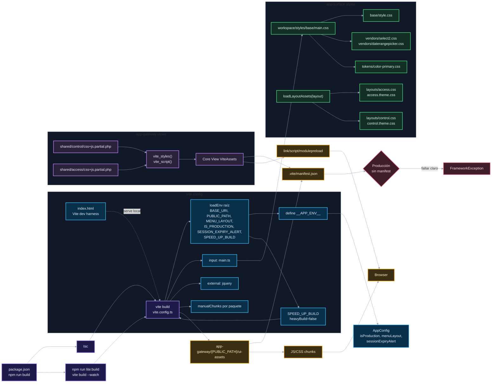

# 05. Vite, styles y assets

Este diagrama explica cómo se compila `app-surface` y cómo `app-gateway` consume esos assets.

## Puntos de control

- El build de surface publica en `app-gateway/{PUBLIC_PATH}/ui-assets`.
- `npm run lite:build` ejecuta `vite build --watch`; no ejecuta `tsc` antes de cada build. Para validación completa usa `npm run build`.
- `ViteAssets` resuelve manifest y tags desde el gateway.
- `index.html` es un harness local de Vite; la UI real de producción la renderiza `app-gateway`.
- En producción, manifest faltante debe fallar claro.
- `jquery` es external porque lo cargan los parciales legacy del gateway.
- Los estilos de layout se cargan dinámicamente desde startup.
- `SPEED_UP_BUILD` solo ajusta el build de Vite; no se inyecta en `__APP_ENV__`.

## Navegación

Anterior: [04. Workspace, toolkit y adapters](04-workspace-toolkit-adapters.md)

Volver al [índice de surface](README.md).
