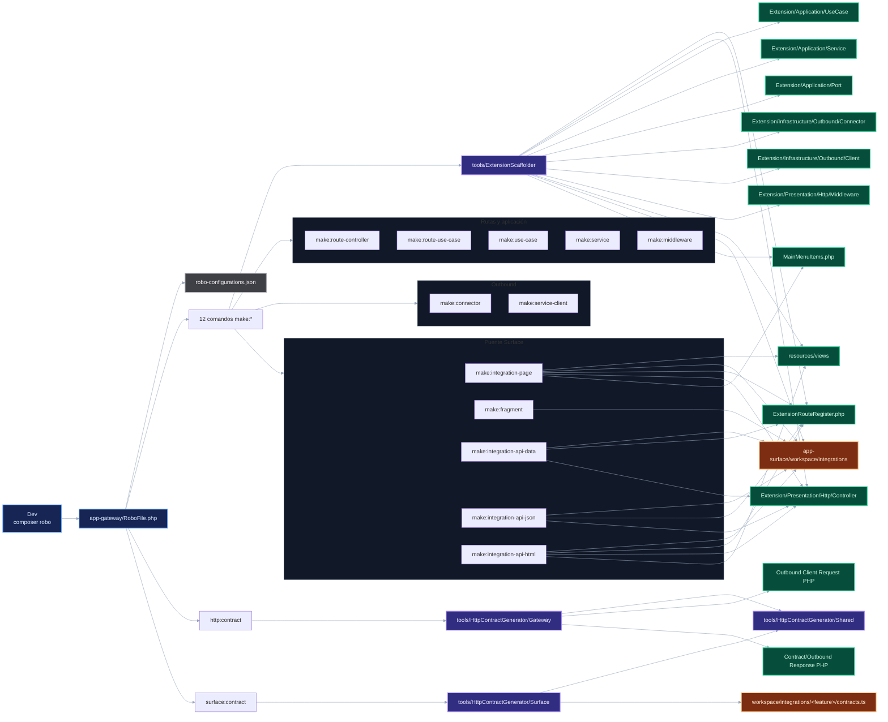

# Robo, scaffolding y contratos

## Reglas del mapa

- `RoboFile.php` expone dos comandos de contratos (`http:contract`, `surface:contract`) y doce comandos `make:*`.
- `tools/ExtensionScaffolder` crea artefactos base y ediciones pequeñas; no decide arquitectura de negocio.
- Los comandos que registran rutas escriben en `ExtensionRouteRegister.php` y abortan si el path ya existe en el árbol de rutas.
- `make:integration-page` crea page SSR + integración Surface y aborta si ya existe `page.ts`, `integration.ts`, registro global del feature o ruta base.
- `make:fragment` solo toca una integración Surface existente y registra el fragment dentro de su `integration.ts`.
- `make:integration-api-data`, `make:integration-api-json` y `make:integration-api-html` exigen que exista la carpeta de feature Surface; crean `api.ts` si falta, agregan función, ruta y action; `html` además crea un fragment SSR base.
- `http:contract` genera PHP outbound para Gateway; no crea clients ni connectors.
- `surface:contract` genera clases TypeScript en `contracts.ts`; no crea `api.ts`, `actions.ts`, routes ni bindings UI.
